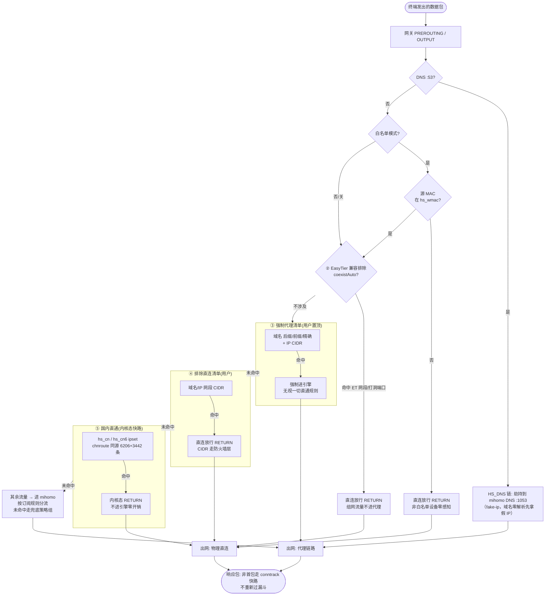
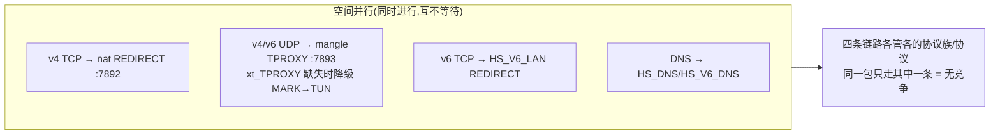
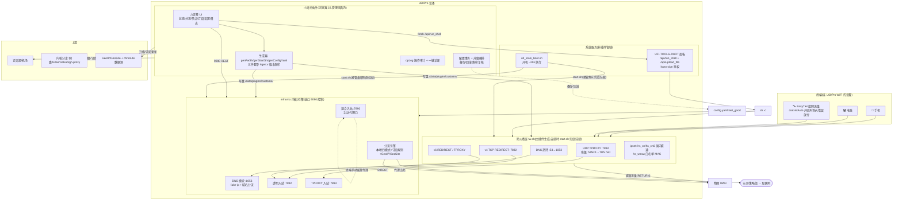

# 小海关 · 分流策略与整体架构

> 两张图：①分流策略（含串行/并行处理）②整体架构。与源码同步维护：改决策顺序或新增锁时请同步更新此文件。

## 图一：分流策略 —— 一个包的五级漏斗（串行判定）

每个经过网关的数据包**严格按 ①→⑤ 顺序串行判定**，命中任意一级即短路离开漏斗（RETURN 或进引擎），**不存在同一包重复判定**。

**判定优先级口诀**（与分流页展示一致）：DNS 劫持 → 白名单门控 → ET 兼容 → 强制代理 → 排除直连 → 国内直通 → 订阅规则兜底。位置越靠前越"硬"（防火墙层/内核态），越靠后越"软"（引擎规则）。

---

## 串行/并行是如何处理的

### 并行发生在哪里：只有"空间并行"，没有"逻辑并行"

- v4 TCP、v6 TCP、v4/v6 UDP、DNS 是**四条独立链路**，天然并行（不同表/不同协议），互不等待也互不覆盖。
- 历史事故反面教材：v1.9.0 之前后段脚本曾二次 `-F HS_V6_LAN` 把并行的 v6 链整链清空——**并行链路之间不允许相互"顺手清理"**，此教训固化进了 fw.sh 生成器。

### 串行发生在哪里：三类全局串行闸

**① 插件操作层（JS 互斥锁）**——用户操作全部串行化：

| 锁 | 守护的操作 | 并发时的行为 |
|---|---|---|
| `opBusy`（op() 统一入口） | 一切经 op 包装的写操作（切模式/开关/保存） | 直接 toast「操作进行中」拒绝 |
| `HS_UPGRADING` | 升级编排（备份→重生成→重启→复核） | 期间一切启停/卸载/规则应用被拒 |
| `hsInstBusy` | 内核在线安装 | 再点=切回进度窗 |
| `hsGeoBusy` / `hsChnBusy` | GeoIP/GeoSite、国内直通路由表下载 | 拒绝并发 |
| `hsDevBusy` | 设备区采集（renderAll 链会连发） | 静默去重 |

**② 设备层（fw.sh 一次性生成 + 串行 shell）**

- 防火墙规则不是"边跑边改"：每次变更 = **整份 fw.sh 重新生成 → `fw_apply` 内部先 `clean`（完全对称删除）再重建**，不存在规则叠加竞争。
- shell 通道（/api/run_shell）按请求串行执行，插件内所有写盘/iptables 操作天然排队。
- 下载类长任务（内核/GeoIP/路由表）统一模式：`nohup curl 后台跑 + 轮询 .exit 哨兵 + 停滞检测`——**下载并行于 UI，判定串行于轮询循环**（一次只轮询一个源，失败才切下一个）。

**③ 数据层（配置事务）**

- 写配置走 `applyWithTxn`：快照 → 写新 → 验证 → 启动失败自动回滚上一份可用配置——**读旧写新串行成对**，杜绝半新半旧。

### 一句话总结

**判定漏斗串行（一个包一条路径，优先级即顺序）；协议链路并行（v4/v6/TCP/UDP 各走各的）；用户操作串行（五把锁 + 升级闸 + 配置事务）；下载任务异步并行但源切换串行。**

---

## 图二：整体架构 —— 三层七件套

### 读图要点

1. **三层职责**：浏览器插件只做"生成 + 编排"（三件套 = fw.sh/start.sh/config.yaml，全部由 JS 生成落盘）；真正的流量在**防火墙层 + mihomo 内核**；面板只是插件的"手脚"（run_shell/upload_file 两个通道 + 9090 控制口）。
2. **版本烙印对账**：三件套生成时烧 `#gen:vX.Y.Z`，插件启动时读烙印与自身版本比对 → 不一致才提示升级（重启引擎即全量重生成）→ 升级后复核烙印确认换新。
3. **自启链**：开机 → ufi_tools_boot.sh（插件唯一启动入口）→ start.sh（按烙印决定是否挂接管，JS 不在场也能恢复）→ mihomo + fw.sh apply。
4. **单点边界**：mihomo 挂 = 透明链路断 → fw.sh clean 自动回直连（启动失败急救/停止逻辑均保证"引擎不在场时规则必须清干净"，防黑洞）。
